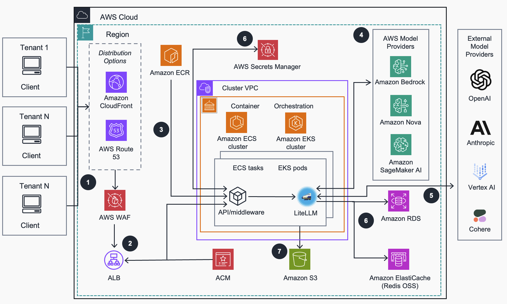

# Guidance for Multi-Provider Generative AI Gateway on AWS

> **🇨🇳 AWS China Region Support** — This fork adds first-class support for AWS China Regions (`cn-northwest-1`, `cn-north-1`), including automatic ARN partition handling, China-specific VPC Endpoint service names, ECR image mirroring, and region-aware service availability checks.

## Table of Contents

- [Project Overview](#project-overview)
- [China Region Support](#china-region-support)
- [Architecture](#architecture)
- [Distribution Options](#distribution-options)
- [Security](#security)
- [How to Deploy](#how-to-deploy)
- [Cost](#cost)
- [Supported Regions](#supported-regions)
- [Open Source Library](#open-source-library)
- [Notices](#notices)

## Project Overview

This project provides a Terraform deployment of [LiteLLM](https://github.com/BerriAI/litellm) into Amazon Elastic Container Service (ECS) and Elastic Kubernetes Service (EKS) on AWS. It is pre-configured with defaults that allow most users to quickly get started with LiteLLM as a unified AI Gateway.

Key capabilities:
- **Unified LLM Interface** — Consistent API across all providers (Bedrock, SageMaker, OpenAI, Anthropic, etc.)
- **Cost Management** — Budget controls, rate limiting, and prompt caching at user/team/API key level
- **Enterprise Security** — WAF, VPC isolation, AWS Bedrock Guardrails, IP-based access control
- **Admin UI** — Configure users, teams, models, and budgets through a web interface

## China Region Support

This fork addresses the unique requirements of deploying in AWS China Regions:

### What's Different in China

| Feature | Global Regions | China Regions |
|---------|---------------|---------------|
| ARN Partition | `arn:aws:` | `arn:aws-cn:` |
| VPC Endpoint Prefix | `com.amazonaws.{region}.*` | Mixed: `cn.com.amazonaws` for ECR/STS/SageMaker; `com.amazonaws` for S3/Logs/SecretsManager |
| Container Registry | `ghcr.io` (direct pull) | Blocked — must mirror to ECR first |
| CloudFront | Available | **Not available** |
| Bedrock | Available | **Not available** (use external providers via LiteLLM) |
| Service Catalog AppRegistry | Available | **Not available** |
| Route 53 Public Zones | Available | Requires ICP filing |

### China-Specific Changes in This Fork

1. **Automatic Partition Detection** — All IAM ARNs, service principals, and resource references use `data.aws_partition.current` instead of hardcoded `aws`
2. **VPC Endpoint Service Name Resolution** — Dynamic locals detect China regions and apply the correct `cn.com.amazonaws` prefix for ECR, STS, and SageMaker endpoints
3. **ECR Image Mirroring** — `scripts/mirror-images-to-ecr.sh` pulls from ghcr.io/Docker Hub (from a global-region EC2) and pushes to your China ECR
4. **Service Availability Guards** — Bedrock VPC endpoints, CloudFront distributions, and Service Catalog resources are conditionally skipped in `cn-*` regions
5. **ALB Security Hardening** — `allowed_cidrs` variable controls ALB ingress (default: empty = no public access). No more `0.0.0.0/0` by default
6. **China Config Template** — `config/default-config-cn-northwest-1.yaml` with SiliconFlow, Zhipu GLM, and other China-accessible providers pre-configured

### Quick Start (China Region)

```bash
# 1. Clone and configure
git clone <this-repo>
cd genai-llm-gateway
cp .env.template .env
# Edit .env — set your region, credentials, etc.

# 2. Mirror container images (run from a machine that can reach ghcr.io)
./scripts/mirror-images-to-ecr.sh

# 3. Deploy
bash deploy.sh

# 4. Add your IP to ALB security group
aws ec2 authorize-security-group-ingress \
  --region cn-northwest-1 \
  --group-id <ALB_SG_ID from output> \
  --protocol tcp --port 443 \
  --cidr YOUR_IP/32
```

## Architecture



### Architecture Steps

1. Client applications access the LiteLLM gateway through ALB (China) or CloudFront → ALB (Global), protected by AWS WAF
2. ALB distributes traffic to ECS Fargate tasks or EKS pods running the AI Gateway containers
3. Container images are stored in Amazon ECR (mirrored from upstream for China regions)
4. LiteLLM routes requests to configured model providers:
   - **Global**: Amazon Bedrock, Amazon Nova, SageMaker, plus external providers
   - **China**: External providers (SiliconFlow, Zhipu, Moonshot, etc.) via OpenAI-compatible API
5. RDS PostgreSQL stores configuration, API keys, and usage tracking
6. ElastiCache Redis provides prompt caching and distributed settings
7. Application logs are stored in S3 and CloudWatch

### AWS Services Used

| Service | Role | China Available |
|---------|------|:---:|
| ECS / EKS | Container orchestration | ✅ |
| ALB | Load balancing + TLS | ✅ |
| RDS PostgreSQL | Config & usage persistence | ✅ |
| ElastiCache Redis | Caching & distributed settings | ✅ |
| ECR | Container image registry | ✅ |
| VPC + NAT | Network isolation | ✅ |
| WAF | Web application firewall | ✅ |
| Secrets Manager | Credential storage | ✅ |
| CloudWatch | Monitoring & logging | ✅ |
| S3 | Log storage | ✅ |
| ACM | TLS certificates | ✅ |
| CloudFront | CDN + DDoS protection | ❌ |
| Bedrock | Managed LLM access | ❌ |
| Service Catalog | App registry | ❌ |
| Route 53 | DNS (requires ICP) | ⚠️ |

## Distribution Options

### Scenario 1: Direct ALB Access (Recommended for China)

```bash
USE_CLOUDFRONT="false"
PUBLIC_LOAD_BALANCER="true"
ALLOWED_CIDRS="your.ip.here/32,office.cidr/24"
```

Best for China regions where CloudFront is not available. WAF protects the ALB directly. **`ALLOWED_CIDRS` restricts access** — no `0.0.0.0/0` by default.

### Scenario 2: Public with CloudFront (Global Regions)

```bash
USE_CLOUDFRONT="true"
PUBLIC_LOAD_BALANCER="true"
```

CloudFront provides global CDN, DDoS protection, and edge caching. ALB is protected by CloudFront secret header authentication. **Not available in China regions.**

### Scenario 3: Custom Domain with Route 53

```bash
USE_ROUTE53="true"
HOSTED_ZONE_NAME="example.com"
RECORD_NAME="genai"
CERTIFICATE_ARN="arn:aws:acm:region:account:certificate/xxx"
```

Works in both global and China regions (China requires ICP filing for public domains).

### Scenario 4: Private VPC Only

```bash
PUBLIC_LOAD_BALANCER="false"
```

Maximum security — ALB in private subnets, accessible only via VPN/Direct Connect/Transit Gateway.

### Configuration Reference

| Parameter | Default | Description |
|-----------|---------|-------------|
| `USE_CLOUDFRONT` | `true` | Enable CloudFront (auto-disabled in China) |
| `USE_ROUTE53` | `false` | Enable Route 53 custom domain |
| `PUBLIC_LOAD_BALANCER` | `true` | Deploy ALB in public subnets |
| `ALLOWED_CIDRS` | `""` (empty) | Comma-separated CIDRs for ALB ingress. Empty = no inbound rules |
| `HOSTED_ZONE_NAME` | `""` | Route 53 hosted zone |
| `RECORD_NAME` | `""` | DNS record subdomain |
| `CERTIFICATE_ARN` | `""` | ACM certificate ARN |

## Security

### ALB Access Control

**This fork defaults to zero inbound access.** The `ALLOWED_CIDRS` variable controls which IPs can reach the ALB:

```bash
# Allow specific IPs only
ALLOWED_CIDRS="203.0.113.10/32,198.51.100.0/24"

# After deployment, add IPs via CLI
aws ec2 authorize-security-group-ingress \
  --group-id <ALB_SG_ID> \
  --protocol tcp --port 443 --cidr YOUR_IP/32
```

### Security Features

- **Network Isolation** — VPC with public/private subnets across multiple AZs
- **WAF Protection** — AWS WAF against common web exploits
- **TLS Everywhere** — HTTPS with TLS 1.2+ via ACM certificates
- **Least Privilege IAM** — Dedicated roles for ECS tasks, execution, and node groups
- **Secrets Management** — API keys and credentials in AWS Secrets Manager
- **Encryption at Rest** — RDS, ElastiCache, EBS, and S3 encrypted
- **No 0.0.0.0/0 Ingress** — ALB security group requires explicit CIDR allowlist

### CloudFront Authentication (Global Only)

When using CloudFront, a custom `X-CloudFront-Secret` header prevents direct ALB bypass. Health check paths are exempted for origin health monitoring.

## How to Deploy

### Prerequisites

- Terraform ≥ 1.5
- AWS CLI v2 configured with appropriate credentials
- Docker (for building middleware image)
- `yq` (YAML processor)

### Step-by-Step

```bash
# 1. Configure environment
cp .env.template .env
vim .env    # Set region, credentials, ALLOWED_CIDRS, etc.

# 2. For China regions: mirror container images first
# (Run from a machine with ghcr.io access)
./scripts/mirror-images-to-ecr.sh

# 3. Deploy everything
bash deploy.sh

# 4. Check outputs
cd litellm-terraform-stack
terraform output
```

### China Region Deployment Notes

1. **Image Mirroring Required** — China cannot pull from ghcr.io directly. Run `mirror-images-to-ecr.sh` from a global-region EC2 or local machine with Docker
2. **No CloudFront** — Set `USE_CLOUDFRONT=false` (auto-detected)
3. **No Bedrock** — Configure external LLM providers in `config/default-config-cn-northwest-1.yaml`
4. **ALB Access** — Remember to add your IP to the ALB security group after deployment

### Detailed Guide

For comprehensive deployment and usage instructions, see the [Implementation Guide](https://aws-solutions-library-samples.github.io/ai-ml/guidance-for-multi-provider-generative-ai-gateway-on-aws.html).

## Cost

### Estimated Monthly Cost (ECS, single AZ)

| Service | Dimensions | Cost/month |
|---------|-----------|-----------|
| ECS Fargate | 2 tasks, ARM, 4 GB memory | $115 |
| VPC + NAT | 1 NAT Gateway, 100 GB egress | $50 |
| RDS PostgreSQL | db.t3.small | $49 |
| ElastiCache Redis | cache.t3.micro | $25 |
| ALB | 1 ALB | $25 |
| CloudWatch | Logs + metrics | $13 |
| WAF | 1 web ACL, 2 rules | $7 |
| S3 + Secrets + KMS | Storage, secrets, keys | $12 |
| **Total** | | **~$296/month** |

> Costs vary by region. China region pricing may differ. Use [AWS Pricing Calculator](https://calculator.aws/) for precise estimates.

## Supported Regions

### Global Regions

| Region | Code |
|--------|------|
| US East (N. Virginia) | `us-east-1` |
| US East (Ohio) | `us-east-2` |
| US West (N. California) | `us-west-1` |
| US West (Oregon) | `us-west-2` |
| Europe (Frankfurt) | `eu-central-1` |
| Europe (Ireland) | `eu-west-1` |
| Europe (London) | `eu-west-2` |
| Europe (Paris) | `eu-west-3` |
| Europe (Stockholm) | `eu-north-1` |
| Canada (Central) | `ca-central-1` |
| South America (São Paulo) | `sa-east-1` |

### 🇨🇳 AWS China Regions (New!)

| Region | Code | Notes |
|--------|------|-------|
| China (Ningxia) | `cn-northwest-1` | ✅ Tested & validated |
| China (Beijing) | `cn-north-1` | ✅ Supported (same adaptations) |

> **China region limitations**: No CloudFront, no Bedrock, no Service Catalog AppRegistry. VPC Endpoint service names use mixed prefixes. Container images must be mirrored to ECR.

## Open Source Library

For information about open source libraries used in this application, see [ATTRIBUTION](ATTRIBUTION.md).

## Notices

Customers are responsible for making their own independent assessment of the information in this Guidance. This Guidance: (a) is for informational purposes only, (b) represents AWS current product offerings and practices, which are subject to change without notice, and (c) does not create any commitments or assurances from AWS and its affiliates, suppliers or licensors. AWS products or services are provided "as is" without warranties, representations, or conditions of any kind, whether express or implied. AWS responsibilities and liabilities to its customers are controlled by AWS agreements, and this Guidance is not part of, nor does it modify, any agreement between AWS and its customers.
